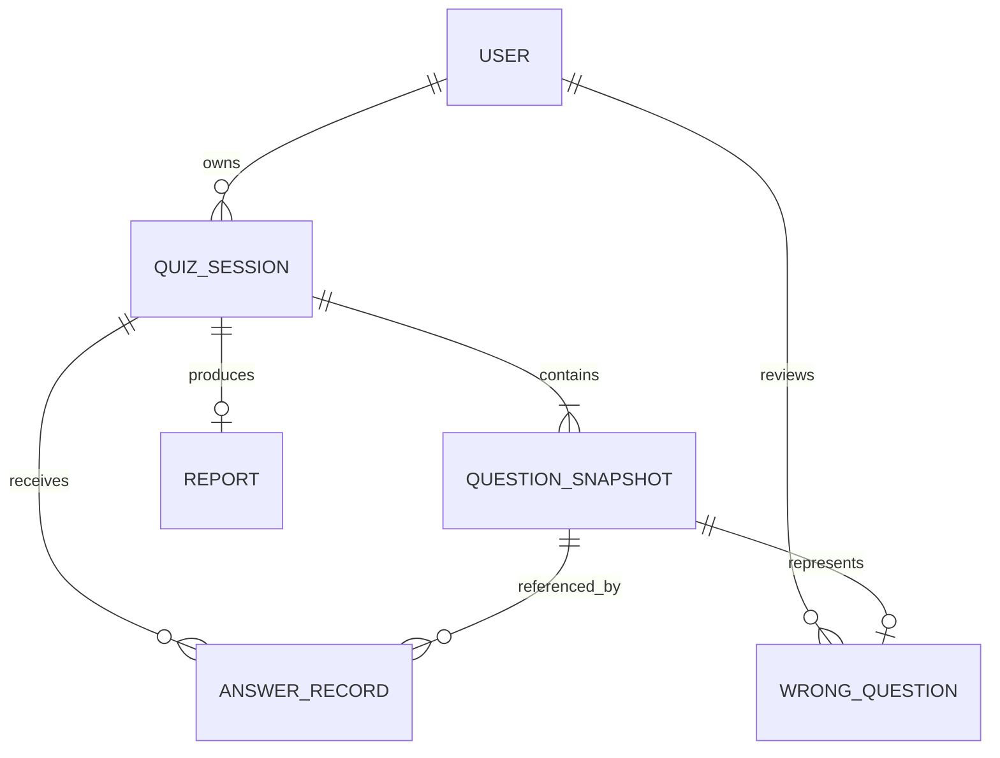

# 鱼皮 AI 闯关学习小程序
# 用户系统与用户功能扩展方案设计

## 1. 方案概述

### 1.1 目标

在现有 FastAPI + Taro React 核心闯关流程上，增加用户身份、学习数据持久化、历史记录和错题复习能力，形成以下闭环：

```text
微信静默登录 -> JWT 鉴权 -> 生成题库并保存 -> 用户答题 -> 保存答题记录
-> 生成并保存报告 -> 查询闯关历史 -> 错题复习
```

### 1.2 本次实现边界

本方案只覆盖已确认的前五批需求：

1. 微信静默登录与 JWT 会话。
2. 用户资料与基础个人中心。
3. 闯关数据持久化。
4. 闯关历史与报告历史。
5. 错题本与复习。

暂不实现学习数据分析、XP/金币/等级/连续学习、设置隐私、多源输入、知识库、社交、支付和多模态能力。

### 1.3 关键确认口径

1. 未登录用户不能生成题库，也不能使用临时体验。
2. 用户昵称和头像允许修改。
3. 当前不提供账号注销。
4. 题库生成成功时保存闯关记录。
5. 中途退出保存未完成闯关，并支持继续。
6. 历史记录暂不删除。
7. 不保存每次生成的完整题库内容；恢复未完成闯关所需的最小题目数据需要保留。
8. 报告生成失败允许稍后重新生成。
9. 同一道错题只保留一条。
10. 错题重新答对后从错题本移除。

## 2. 总体架构

### 2.1 分层结构

```text
Taro 小程序
  - 登录态管理
  - 用户中心、历史、错题页面
  - 闯关状态与本地临时状态
  - Taro.request / Taro.login / Taro.setStorage
          |
          v
FastAPI API
  - 路由与统一响应
  - JWT 鉴权依赖
  - Pydantic 请求响应模型
  - 用户、闯关、历史、错题服务
          |
          +--> 微信登录服务：code -> jscode2session -> openid
          +--> AI 服务：现有题库与报告生成
          +--> MySQL 8.x：用户和学习数据
```

### 2.2 设计原则

1. 用户身份只从 JWT 得到，不信任请求体中的 user_id。
2. 所有用户数据查询都强制带当前用户条件。
3. 重要写操作使用事务和幂等约束。
4. 报告正确率由服务端答题记录计算，客户端只提交答案事实。
5. 保留现有 AI 生成服务，先通过适配层接入持久化，不把数据库逻辑塞入 LLM 服务。
6. 统一错误响应，避免向客户端泄露微信密钥、JWT 密钥或数据库错误细节。

## 3. 身份认证方案

### 3.1 登录流程

1. 小程序启动时检查本地 JWT。
2. 没有 JWT 或 JWT 已失效时调用微信登录能力获得临时登录凭证 `code`。
3. 前端将 `code` 发送到后端登录接口。
4. 后端服务端调用微信登录接口换取 `openid`。
5. 后端以 `openid` 查询用户；不存在则创建用户，存在则更新最近登录时间。
6. 后端签发 JWT，JWT 的主体只包含内部用户 ID 和必要的时间声明。
7. 前端保存 JWT，并在受保护请求的 `Authorization: Bearer <token>` 头中携带。
8. 后端通过 JWT 依赖获得当前用户。
9. JWT 过期返回未认证错误，前端清理旧 JWT 后重新静默登录。

### 3.2 静默登录边界

微信静默登录不要求手机号授权。由于本次确认不允许临时体验，登录失败时不继续生成题库，页面展示登录失败或网络异常状态，并提供重试。

### 3.3 JWT 策略

1. 使用签名 JWT，不在 JWT 中保存昵称、头像等可变资料。
2. 使用配置中的强随机密钥签名，密钥不进入代码仓库。
3. 校验签名、算法、过期时间和主体用户 ID。
4. 访问受保护资源统一使用 Bearer 认证。
5. 本方案暂定 access token 有效期为 120 分钟；实现前可根据联调需要调整。
6. 当前版本不单独实现 refresh token；过期后重新执行微信静默登录。
7. 退出登录至少清理客户端 JWT；服务端学习数据不删除。

## 4. MySQL 数据设计

### 4.1 数据库约定

1. MySQL 8.x。
2. 字符集使用 `utf8mb4`。
3. 数据库时区沿用用户确认的默认设置，应用层统一使用明确的时间类型。
4. 数据库连接信息全部通过环境变量提供。
5. 迁移脚本负责创建和升级表结构，不在应用启动时隐式破坏数据。

### 4.2 核心实体

#### User

保存内部用户 ID、微信 `openid`、昵称、头像、创建时间、更新时间和最近登录时间。`openid` 必须唯一。

#### QuizSession

保存用户 ID、闯关 ID、主题、标题、摘要、状态、题目数量、创建时间、开始时间、完成时间、总耗时和统计结果。状态至少包括 `in_progress`、`completed`、`report_pending` 和 `failed`。

虽然不保存“每次生成的完整题库内容”，但为了支持中途继续和历史详情，需要保存本次闯关渲染和复盘所需的最小题目快照，或采用等价的持久化方式。该取舍在实现前固定为一种方案，避免产生无法恢复的未完成记录。

#### QuestionSnapshot

保存闯关所属关系、题目 ID、题型、题干、选项、正确答案、解析、知识点和排序号。它是生成题库时的业务快照，不作为跨闯关共享题库。

#### AnswerRecord

保存用户、闯关、题目、用户选择、是否正确、答题耗时、提交时间。用户、闯关和题目组合建立唯一约束，防止同一题重复计入。

#### Report

保存闯关 ID、报告内容、生成状态、生成次数、创建时间和更新时间。报告生成失败保留闯关结果，允许重新生成。

#### WrongQuestion

保存用户 ID、题目快照 ID、首次答错时间、最近答错时间、错题次数、复习建议时间。用户重新答对时删除该用户对应的错题记录。

### 4.3 数据关系



### 4.4 索引与隔离

1. `user.openid` 唯一索引。
2. `quiz_session.user_id, created_at` 组合索引。
3. `answer_record.user_id, quiz_session_id, question_id` 唯一约束。
4. `wrong_question.user_id, question_snapshot_id` 唯一约束。
5. 所有详情查询使用 `WHERE user_id = current_user.id` 或通过所属关系校验。

## 5. API 设计

### 5.1 统一响应

成功：

```json
{
  "code": 0,
  "message": "ok",
  "data": {}
}
```

失败：

```json
{
  "code": 4010,
  "message": "登录状态已失效",
  "data": null
}
```

### 5.2 认证接口

#### `POST /api/v1/auth/wechat-login`

请求：`{ "code": "微信临时登录凭证" }`

响应数据：用户基础信息和 JWT。后端不向前端返回 `AppSecret` 或微信接口原始响应。

#### `POST /api/v1/auth/logout`

需要 JWT。清理当前客户端会话所需状态；不删除用户学习数据。

#### `GET /api/v1/users/me`

需要 JWT。返回当前用户昵称、头像和内部用户标识。

#### `PATCH /api/v1/users/me`

需要 JWT。只允许修改已确认可修改的昵称和头像，并做长度、格式和内容校验。

### 5.3 闯关接口

#### `POST /api/v1/quiz/generate`

需要 JWT。调用现有 AI 出题服务，生成成功后立即创建 `QuizSession` 和题目快照，返回闯关 ID及题目数据。

#### `POST /api/v1/quiz/{quiz_id}/answers`

需要 JWT。提交当前闯关的一道题答案。服务端根据题目快照判定正确性并写入答题记录，重复提交按幂等请求处理。

#### `POST /api/v1/quiz/{quiz_id}/complete`

需要 JWT。确认用户完成闯关，服务端检查题目是否全部完成，计算统计并将状态置为完成。最后一道题必须在完成事务中可见。

#### `POST /api/v1/quiz/{quiz_id}/report`

需要 JWT。为当前用户的已完成闯关生成或重新生成报告。失败时保留可重试状态。

#### `GET /api/v1/quiz/in-progress`

需要 JWT。返回当前用户可继续的未完成闯关列表。

### 5.4 历史接口

#### `GET /api/v1/history/quizzes?page=1&page_size=20`

需要 JWT。返回当前用户的闯关历史，按创建时间倒序分页。

#### `GET /api/v1/history/quizzes/{quiz_id}`

需要 JWT。返回当前用户的闯关详情、答题记录和报告。

### 5.5 错题接口

#### `GET /api/v1/wrong-questions?page=1&page_size=20`

需要 JWT。返回当前用户的错题列表，按主题或知识点分组所需的数据返回。

#### `GET /api/v1/wrong-questions/{wrong_question_id}`

需要 JWT。返回错题详情。

#### `POST /api/v1/wrong-questions/{wrong_question_id}/retry`

需要 JWT。创建基于该错题的复习闯关入口；答对后删除错题记录。

## 6. 业务流程

### 6.1 生成题库

1. 前端完成静默登录。
2. 前端提交主题和 JWT。
3. 后端校验用户身份和输入内容。
4. AI 服务生成并校验题库。
5. 数据库事务写入闯关记录和最小题目快照。
6. 事务成功后返回题库。
7. 数据库写入失败时不返回可开始的闯关，并提示重试。

### 6.2 答题和完成

1. 前端展示题目并允许本地即时反馈。
2. 每题提交时将选择发送给后端。
3. 后端从题目快照读取正确答案，不信任前端传入的 `is_correct`。
4. 通过唯一约束和幂等逻辑防止同题重复计入。
5. 最后一题保存成功后，再执行完成统计。
6. 完成统计和状态更新使用同一事务。
7. 若报告生成失败，闯关保持已完成且报告可重试。

### 6.3 中途退出和继续

1. 生成成功的闯关默认进入 `in_progress`。
2. 用户退出页面不会删除服务端记录。
3. 继续入口读取当前用户的未完成闯关。
4. 恢复时使用服务端保存的题目快照和已提交答题记录。
5. 已提交题目不可重复计入。

### 6.4 错题复习

1. 答错时创建错题记录；重复答错只更新次数和最近答错时间。
2. 错题列表展示可解释的复习建议日期。
3. 复习闯关答对后，在同一事务中删除当前用户的错题记录。
4. 复习答错则保留记录并更新复习信息。
5. 不使用用户可控参数删除其他用户错题。

## 7. 前端改造方案

### 7.1 状态模块

新增轻量认证状态管理，至少包含：

- `token`
- `user`
- `isAuthenticated`
- `loginStatus`
- `loginError`

请求封装统一注入 Bearer JWT；收到 401 时只允许一次自动重新登录，避免无限重试。

### 7.2 页面拆分

在现有首页单页状态机之外，新增以下 Taro 页面：

1. 登录引导/登录状态页。
2. 我的个人中心。
3. 闯关历史列表。
4. 闯关详情。
5. 错题本。
6. 错题详情和复习入口。

现有首页、闯关、结算、报告页面保留，但生成题库前必须确认登录成功，并将闯关 ID 与服务端记录绑定。

### 7.3 原型遵循

1. 个人中心遵循原型 2 的头像、昵称、功能入口布局。
2. 错题本遵循原型 2 的按主题分组和复习提示布局。
3. 不实现原型 2 中本次暂不纳入的分析、排行榜、PK 页面。
4. 不实现原型 3 中本次暂不纳入的设置、会员、知识库和多源输入页面。
5. 所有列表补充加载、空数据、失败和重试状态。

## 8. 后端项目改造

建议新增以下模块，保持现有 LLM 服务职责不变：

```text
backend/
  app/
    api/
      auth.py
      users.py
      history.py
      wrong_questions.py
      quiz.py
    core/
      config.py
      security.py
      database.py
    models/
      user.py
      learning.py
    schemas/
      auth.py
      user.py
      learning.py
    repositories/
      user_repository.py
      learning_repository.py
    services/
      auth_service.py
      user_service.py
      learning_service.py
      wrong_question_service.py
```

实际拆分可以结合当前仓库规模调整，但必须保持路由、服务、数据访问和模型职责清晰。

## 9. 环境配置

后端 `.env` 需要填写以下配置，模板位于 `backend/.env.example`：

```dotenv
WECHAT_APP_ID=
WECHAT_APP_SECRET=

MYSQL_HOST=
MYSQL_PORT=3306
MYSQL_DATABASE=
MYSQL_USER=
MYSQL_PASSWORD=
MYSQL_CHARSET=utf8mb4
MYSQL_TIMEZONE=

JWT_SECRET_KEY=
JWT_ALGORITHM=HS256
JWT_ACCESS_TOKEN_EXPIRE_MINUTES=120
```

`DEEPSEEK_*` 配置继续用于现有 AI 能力。生产环境必须关闭 `ENABLE_MOCK_LOGIN`；本地测试可通过 mock 登录替代真实微信接口。

## 10. TDD 与验证计划

### 10.1 第 1 批测试

1. 新 `openid` 创建用户。
2. 已存在 `openid` 复用用户。
3. JWT 签发、解析、过期和非法签名失败。
4. 未认证请求返回 401。
5. mock 登录只在开发环境可用。

### 10.2 第 2 批测试

1. 用户只能获取自己的资料。
2. 昵称和头像修改成功。
3. 非法长度或内容被拒绝。
4. 资料加载失败返回明确错误。

### 10.3 第 3 批测试

1. 题库生成成功后立即保存闯关。
2. 题目快照可用于继续未完成闯关。
3. 答题记录按用户隔离。
4. 服务端重新计算正确性。
5. 最后一题进入最终统计。
6. 重复提交不重复计入。
7. 报告失败可重新生成。

### 10.4 第 4 批测试

1. 历史按时间倒序。
2. 分页无重复和遗漏。
3. 详情只能访问本人记录。
4. 未完成闯关可继续。
5. 历史不提供删除操作。

### 10.5 第 5 批测试

1. 首次答错创建错题。
2. 重复答错只更新同一条错题。
3. 错题按用户隔离。
4. 重新答对后移除错题。
5. 复习答错保留错题。

### 10.6 验证顺序

每个批次遵循：

1. 先写失败测试。
2. 运行测试确认 RED。
3. 编写最小实现。
4. 运行相关测试确认 GREEN。
5. 做必要重构。
6. 运行后端完整测试并检查覆盖率目标。
7. 构建 Taro 微信小程序。
8. 进行关键页面和接口联调。

## 11. 风险与处理

1. 微信登录接口依赖 AppID、AppSecret 和合法配置；本地使用 mock 登录，真实联调前再切换。
2. 不保存完整题库内容与支持未完成续闯存在天然冲突；必须保留可恢复闯关所需的最小题目快照。
3. JWT 无状态特性意味着退出登录无法天然吊销已签发 token；本期通过短有效期、客户端清理和重新登录处理，若后续需要即时吊销再增加服务端会话黑名单。
4. 现有前端状态机需要拆出页面和认证状态，必须优先保证核心输入到报告流程不回归。
5. MySQL 连接配置未填写前，只能完成代码级测试或使用测试数据库，不能进行真实持久化联调。

## 12. 实施顺序

1. 第 1 批：配置、MySQL 基础设施、微信登录、JWT 和认证测试。
2. 第 2 批：用户资料接口、个人中心页面和资料测试。
3. 第 3 批：闯关快照、答题记录、报告保存和最后一题回归测试。
4. 第 4 批：历史列表、详情、未完成续闯和分页测试。
5. 第 5 批：错题本、复习入口、答对移除和错题隔离测试。
6. 完成每批次的前后端联调、构建和回归验证。
